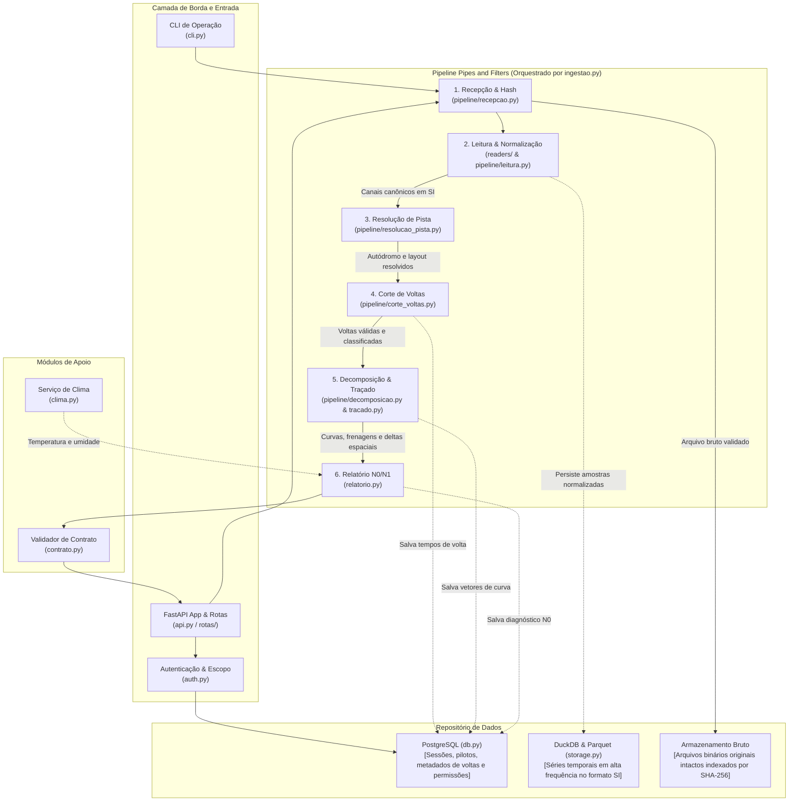

# Diagrama de componentes

Estrutura interna dos componentes do SARU PoC Trackday organizada pelo estilo arquitetural Pipes and Filters com Repositório de Dados.

## Diagrama C4 componentes (Nível 2)

## Responsabilidades por componente

1. `api.py` e `rotas/`: expõe endpoints REST e WebSockets, gerenciando uploads multipart assíncronos e consultas de relatórios.
2. `auth.py`: aplica controle de acesso baseado em escopo (PIL-RNF-07), garantindo que nenhum piloto acesse dados alheios.
3. `recepcao.py`: calcula o hash SHA-256 para idempotência e salva o arquivo binário original sem qualquer alteração.
4. `readers/` e `leitura.py`: detecta o formato do arquivo, extrai canais brutos e mapeia grandezas para o vocabulário canônico em unidades SI.
5. `resolucao_pista.py`: identifica o autódromo por proximidade geográfica das coordenadas ou por nome declarado no simulador.
6. `corte_voltas.py`: localiza cruzamentos da linha de largada e chegada, valida cobertura da pista e classifica voltas anômalas.
7. `decomposicao.py` e `tracado.py`: interpola séries no eixo de distância, detecta zonas de frenagem, calcula trail-braking e métricas de curva.
8. `relatorio.py`: sintetiza deltas de tempo, consistência de pilotagem e orientações em linguagem natural direta para o nível N0.
9. `storage.py` e `db.py`: implementam o padrão Repositório, isolando o mecanismo físico de armazenamento do restante da lógica.

