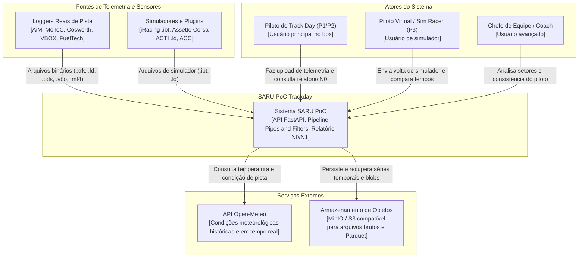

# Diagrama de contexto

Visão de fronteira do sistema SARU PoC Trackday (família Piloto), identificando os usuários humanos, fontes de dados e integrações externas.

## Diagrama C4 contexto (Nível 1)

## Elementos e interfaces

1. Piloto de Track Day: envia o lote de arquivos após a bateria e consome o diagnóstico N0 em menos de cinco segundos no smartphone ou tablet.
2. Piloto Virtual: envia arquivos gravados no iRacing ou Assetto Corsa para receber a mesma análise da pista real sem depender de coordenadas GPS.
3. Chefe de Equipe e Coach: consome relatórios consolidados para orientar o piloto entre as sessões.
4. Loggers e Simuladores: sistemas proprietários que geram arquivos binários com taxas de aquisição entre 1 Hz e 1000 Hz.
5. API Open-Meteo: fornece dados meteorológicos para correlacionar desempenho com temperatura e condição de pista.
