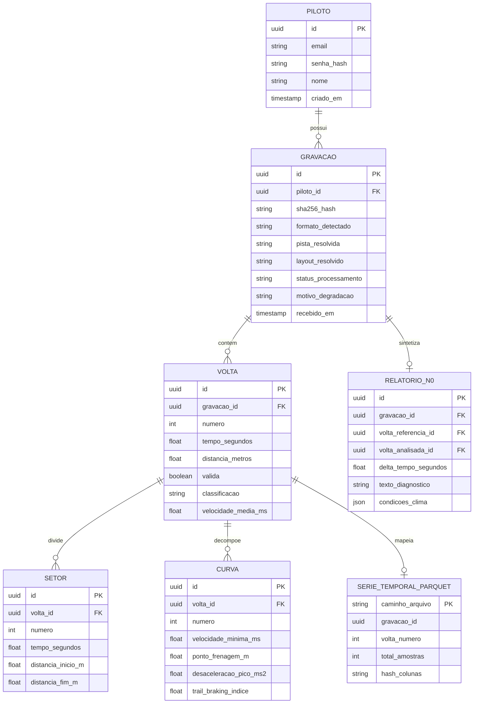

# Modelo de dados e persistência híbrida

Estratégia de segregação de dados entre banco relacional para metadados e arquivos colunares para séries temporais de alta frequência.

## Arquitetura de persistência

## Divisão de responsabilidades de armazenamento

1. Banco Relacional (PostgreSQL):
Armazena entidades com relacionamentos estritos, regras de integridade referencial e filtros de controle de acesso por piloto. Consultas de listagem, tempos de volta e relatórios N0 são resolvidas diretamente nesta camada.

2. Séries Temporais (Apache Parquet e DuckDB):
Armazena as medições contínuas de sensores (taxas de 10 Hz a 1000 Hz). Cada volta gera um arquivo Parquet imutável particionado pelo identificador da gravação. O formato colunar permite consultas rápidas de canais específicos sem carregar o conjunto inteiro na memória.

3. Armazenamento de Arquivos Brutos:
Mantém o binário original recebido do piloto, identificado pelo hash SHA-256 em diretório particionado pelos dois primeiros caracteres do hash. Permite reprocessamento futuro com versões atualizadas dos algoritmos sem perda da fonte primária.

