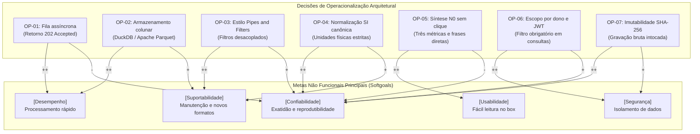

# NFR Framework: grafo de interdependência de metas flexíveis

Análise de requisitos não funcionais e trade-offs arquiteturais usando a abordagem de Chung et al. (2000), adotada no módulo Base de Arquitetura e Desenho de Software (FGA0208).

## Grafo de interdependência de metas flexíveis (SIG)

## Análise de impactos e trade-offs

1. Fila assíncrona contra simplicidade operacional:
A resposta 202 com execução em segundo plano melhora o tempo de percepção do usuário no upload (impacto ++ em Desempenho). Exige monitoramento do ciclo de vida da tarefa e recuperação de falhas em workers (impacto - em Confiabilidade operacional simples).

2. Síntese N0 contra detalhamento analítico:
Exibir apenas três números e três recomendações no box permite leitura em cinco segundos sem distração (impacto ++ em Usabilidade). Suprime dados avançados de engenharia de pista na primeira tela (impacto - em completude imediata, resolvido pelo acesso posterior ao nível N1).

3. Normalização canônica no Sistema Internacional (SI):
A conversão prévia de todos os canais para metros por segundo, radianos e pascals elimina divergências entre loggers diferentes (impacto ++ em Confiabilidade e Suportabilidade). Aumenta o custo computacional no estágio de ingestão (impacto neutro mitigado pela escrita vetorial em Parquet).

