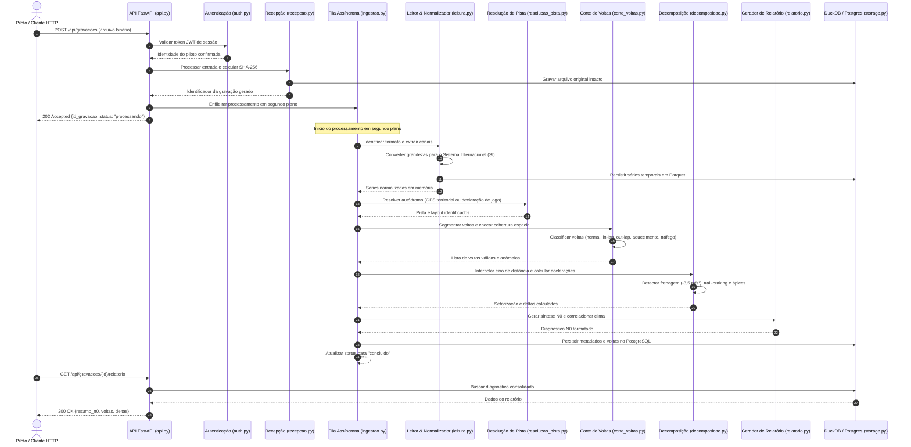

# Diagrama de sequência: ingestão e diagnóstico N0

Fluxo dinâmico de processamento de um arquivo de telemetria desde o upload HTTP até a disponibilização do diagnóstico N0.

## Diagrama de sequência UML

## Pontos de controle do fluxo

1. Resposta rápida no passo 7: o piloto recebe confirmação imediata de recebimento antes de qualquer computação pesada.
2. Imutabilidade no passo 4: o arquivo original é gravado em disco ou bucket antes de qualquer transformação numérica.
3. Resiliência no passo 12: se a volta apresentar extensão anômala, o pipeline categoriza o tipo da volta sem interromper a execução das demais voltas.
4. Consulta sem processamento no passo 20: leituras posteriores do relatório consomem dados já agregados, garantindo resposta em poucos milissegundos.

