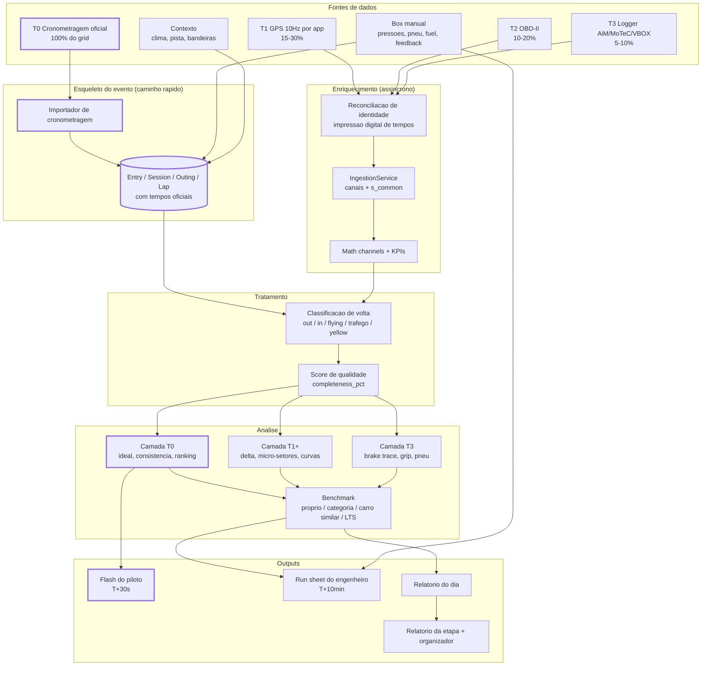
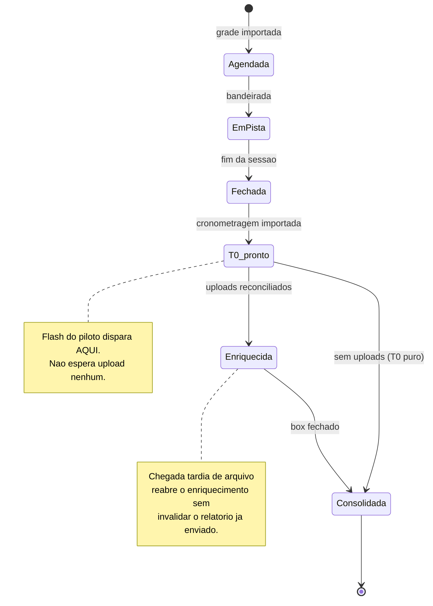

# Blueprint de Coleta, Planalto Trackday + Brasília Touring Series

- **Data:** 2026-08-12
- **Evento-alvo:** etapa Planalto Trackday + Brasília Touring Series, Autódromo Internacional Nelson Piquet (BSB), formato 2 dias
- **Por que este evento:** o `saru-KB` o lista como alvo #5 de beachhead, *"evento recorrente com pilotos locais e regionais; formato time attack e series é natural para ranking e análise por setores"* (`50_company/research/Track Day no Brasil 2026…md:131`), no hub geográfico da SARU (BSB, `:130`). É o caso-teste certo porque **quebra todas as premissas confortáveis** do produto atual: muitos pilotos, categorias misturadas, e a esmagadora maioria dos carros **sem nenhum logger**.
- **Documento irmão:** `2026-08-12-gap-analysis-hierarquia-motorsport.md` (modelo de dados). Aqui trato da operação: coleta, tratamento, análise e relatórios.

---

## 1. O que este evento realmente é (e por que isso muda o produto)

Um mesmo fim de semana contém, na mesma pista, populações incompatíveis:

| População | Perfil | Instrumentação típica | O que quer do dado |
|---|---|---|---|
| **Brasília Touring Series** | competição, grid fixo, categorias por preparação | alguns com AiM/MoTeC; quase todos com transponder | ganhar a categoria: setor, setup, pneu |
| **Track day, grupo rápido** | carros preparados, pilotos experientes | GoPro, alguns AiM Solo | baixar o tempo, comparar com o vizinho |
| **Track day, grupo intermediário/iniciante** | carros de rua, primeira ou segunda vez na pista | celular, no máximo | "estou indo bem? o que faço na curva 3?" |
| **Meet/superesportivos** | McLaren, Porsche GT3 RS, Lamborghini (KB `:25`) | nenhuma | experiência, número para postar |

**Consequência central:** um produto que só funciona com telemetria completa atende ~5% do grid. O desenho abaixo parte do princípio inverso, **todo participante recebe relatório; a profundidade é função do que ele tem**. Isso não é concessão comercial: é a mesma regra de engenharia que o engine já aplica nos canais (*"degradação graciosa, nunca fabricação de dado"*, `domain/models.py:605`, `MathChannelsReport`). Aqui ela sobe de nível: da análise para o evento inteiro.

---

## 2. A decisão central, camadas de instrumentação (T0-T4)

| Tier | Fonte | Cobertura realista | Canais obtidos | Análises viáveis | Teto (o que **não** dá) |
|---|---|---|---|---|---|
| **T0** | **Cronometragem oficial** (transponder / MyLaps / feed do organizador) | **100% do grid**, custo zero, zero ação do piloto | tempo por volta, 2-3 setores, classificação, hora | melhor volta, volta ideal (soma dos melhores setores), consistência em voltas limpas, evolução sessão a sessão, ranking na categoria, setor forte/fraco vs. melhor do grupo | nada dentro da curva; nada sobre o piloto |
| **T1** | **GPS 10 Hz por app** (RaceChrono, TrackAddict, Harry's) | 15-30% *se* houver onboarding ativo | posição, velocidade, acelerações derivadas, traçado | delta contra referência, micro-setores, velocidade mínima/apex por curva, ponto de frenagem estimado, consistência de traçado, **geração do mapa da pista** | pressão de freio, inputs reais, pneu |
| **T2** | **T1 + OBD-II** | 10-20% (carros de rua modernos) | RPM, marcha, TPS (quando exposto), temp. água/óleo | pontos de troca, % full-throttle, **alertas térmicos** (crítico em BSB), erros de marcha | freio, esterço, suspensão |
| **T3** | **Logger dedicado** (AiM `.xrk`, MoTeC `.ld/.ldx`, VBOX) | 5-10% (BTS de ponta, preparados) | + pressão de freio, esterço, suspensão, às vezes temp. de pneu | **toda a suíte SARU atual**: brake trace, coasting, over-slowing, friction ellipse, grip factor, driver confidence index, tyre report | limitado pelo que o carro tem instalado |
| **T4** | **Vídeo** (GoPro/celular) | 40-60%, hoje 100% desperdiçado | imagem + áudio | sincronização por tempo de volta, overlay, evidência de tráfego/incidente | não é dado numérico |

**Duas fontes não-telemétricas que valem mais que T2 e custam apenas disciplina:**

- **Box (manual):** pressões a frio e a quente, pirômetro por canto (3 pontos), combustível, ajustes feitos, feedback do piloto. É o que transforma track day em engenharia, e é exatamente o que hoje não tem onde ser gravado (gap **G4**: a `TracksideView` escreve num blob de layout por usuário, sobrescrito).
- **Contexto:** temperatura de ar e de pista, chuva, bandeiras, incidentes. Hoje `crm_weather` é uma lista global sem FK (gap **G5**).

> **Regra de projeto:** o caminho T0 tem que funcionar sozinho, ponta a ponta, sem depender de nenhum upload. Todo o resto é enriquecimento assíncrono sobre um esqueleto que já existe e já gerou relatório.

---

## 3. Estrutura de dados para multi-piloto e multi-categoria

O modelo proposto no documento irmão (Etapa ▸ Sessão ▸ Outing ▸ Volta) resolve o fim de semana de **uma** equipe. Um evento aberto com 60 inscritos exige três ajustes, e um deles **corrige** o que propus antes:

### 3.1 `Entry`, o competidor é o par (carro, número), não o piloto

```
Event ─┬─> Entry (nº 17, Civic Si, categoria BTS-B, equipe X)
       └─> Session (bloco da grade: "Sessão 3 · Grupo B · 10h40")
                        │
                 Outing (entry 17 × sessão 3 × PILOTO × jogo de pneu × setup)
                        └─> Lap
```

- **`Session` é o bloco da grade**, compartilhado por todo um grupo, não pertence a um piloto. Num track day, a sessão é "Grupo B, 20 minutos"; 18 carros estão nela.
- **`Outing` é a participação** de uma entry naquele bloco. É onde piloto, setup, jogo de pneu e combustível são fixados.

### 3.2 Correção ao desenho anterior: `driver_id` pertence ao Outing, não à Session

No documento irmão coloquei `driver_id` em `Session`. Está errado para este evento: **carro compartilhado é a norma** em track day e enduro, dois pilotos revezam a mesma entry entre sessões, às vezes dentro da mesma sessão. Com `driver_id` na sessão, o revezamento é irrepresentável. A chave correta é `Outing(entry, driver, session)`, com o piloto principal da entry como default.

### 3.3 Categoria e grupo são eixos distintos

`categoria` (BTS-A, BTS-B, track day preparado, track day rua, superesportivo) define **com quem você é comparado** e qual esquema de coleta se aplica. `grupo` (A/B/C) define **quando você anda**. Colapsar os dois, o atalho tentador, quebra o benchmarking: o grupo rápido mistura categorias, e comparar um Civic preparado com um GT3 RS porque andam juntos é ruído, não análise.

Isso se soma aos dois discriminadores já propostos (`discipline` × `environment`): a tupla que resolve esquema de coleta, workbook e calibração passa a ser **`(discipline, environment, categoria)`**.

---

## 4. A operação, o que acontece antes, durante e depois

### 4.1 Pré-evento (D-7 a D-1)

1. **Criar a Etapa** e importar a **grade** do organizador (grupos, sessões, horários).
2. **Importar a lista de inscritos** (CSV do organizador / plataforma de inscrição) → cria as `Entry` automaticamente: número, piloto, carro, categoria, grupo.
3. **Cadastrar a pista.** Bloqueador literal e verificado: `config/tracks.yaml` tem 22 pistas, Interlagos, Goiânia, Curitiba, Velocitta, Tarumã, Cascavel e 16 internacionais, e **nenhuma de Brasília**. Sem `track_id`, não há setores, não há curvas nomeadas, não há análise por curva. Solução barata: uma volta com GPS gera o traçado via `saru_lapanalyzer/tools/trackmap_cli.py`, que já existe e emite o bloco YAML pronto; as curvas são nomeadas uma vez, à mão, e reusadas para sempre.
4. **Onboarding do piloto por QR** (cartaz no box, link na confirmação da inscrição): nome, carro, categoria, consentimento LGPD, e, para quem quiser T1, instruções de 3 passos do app de GPS.
5. **Definir o tier por entry**: o que cada carro tem. Determina qual relatório ele vai receber e evita prometer o que não se pode entregar.

### 4.2 Durante o evento, o ciclo por sessão

```
bandeirada da sessão
   ├─ [0-2 min]  Data steward exporta a cronometragem e importa   → T0
   ├─ [~30 s]    Flash do piloto dispara (só T0)                  → celular
   ├─ [2-10 min] Uploads T1/T3 chegam, reconciliação automática   → enriquecimento
   ├─ [box]      Engenheiro fecha o pós-outing no tablet          → manual
   └─ [10 min]   Relatório de sessão completo por tier
```

**Papéis humanos** (a coleta é um processo, não só um schema):

| Papel | Quem | Carga | O que faz |
|---|---|---|---|
| **Data steward** | 1 pessoa da SARU por evento | contínua | importa cronometragem a cada sessão, resolve reconciliações duvidosas, garante relatório saindo |
| **Engenheiro de box** | por carro/equipe do pacote Pro | 60 s por outing | pré-outing (pressões, combustível, ajuste) e pós-outing (feedback) no tablet |
| **Piloto** | ele mesmo | 1 min | onboarding por QR; upload do app; feedback por voz |
| **Organizador** | parceiro | 1× por sessão | fornece o export da cronometragem |

**Restrições reais do box que definem a UI:** 15-20 min entre sessões, mãos sujas, sol na tela, 4G ruim. Decorre daí um requisito arquitetural duro: **a coleta de box tem que ser offline-first, com fila de sincronização**, o que a stack atual (Next.js + REST online) não faz. Máximo 4 toques por outing; feedback do piloto por **áudio** com transcrição posterior, nunca por formulário de texto.

### 4.3 A dependência comercial que vale mais que qualquer código

Todo o caminho T0, que é o que dá cobertura de 100% do grid, depende de **um arquivo**: o export da cronometragem oficial, por sessão. Negociar esse acesso com o organizador é o item de maior alavancagem do projeto inteiro. Sem ele, sobra o modelo "cada piloto sobe o seu", que atende 20% do grid e não produz ranking nem benchmark. Com ele, um data steward cobre o evento todo.

---

## 5. Tratamento dos dados

### 5.1 Reconciliação de identidade, o problema difícil

A cronometragem conhece o **carro #17**. O arquivo do AiM não sabe que existe um número 17; o app de GPS conhece um telefone. Casar as três coisas é obrigatório e não pode errar: atribuir a telemetria do piloto A ao piloto B destrói a confiança no produto de forma irrecuperável.

**Método, em ordem de confiança:**

1. **Impressão digital da sequência de tempos.** A cronometragem dá a sequência exata de tempos do #17 na sessão 3. Qualquer arquivo daquela sessão tem sua própria sequência. Correlação cruzada casa com altíssima confiança, tempos de volta em resolução de milissegundo são efetivamente únicos num grid.
2. **Janela de hora do dia** + sessão declarada no upload.
3. **Declaração do piloto** no upload.

**Confirmação humana obrigatória abaixo do limiar de confiança.** Nunca atribuir em silêncio.

### 5.2 Classificação de volta, e por que a métrica de consistência atual engana

Toda volta recebe um tipo: `out_lap`, `in_lap`, `flying`, `traffic`, `yellow`, `incomplete`, `invalid`.

**Detecção de tráfego** é o que separa um relatório útil de um relatório irritante num track day: metade das voltas está comprometida por tráfego, e dizer a um piloto que ele é "inconsistente" quando ele passou três voltas atrás de um carro mais lento é errado e ele sabe que é errado.

- Com **T1+**: comparar o perfil de velocidade contra a melhor volta do próprio piloto, perda concentrada numa zona, com alívio de acelerador **sem** mudança correspondente de freio/esterço = tráfego.
- Com **T0 apenas**: um setor muito mais lento com os outros normais, de forma isolada = provável tráfego.

Marcar, **não descartar**, o piloto precisa ver que a volta existiu e por que não conta.

Isso corrige um defeito concreto do código atual: `SessionSummary.consistency_pct` (`domain/models.py:445`) é `std(lap_times)/best_lap_time` sobre todas as voltas válidas. Num track day isso mede tráfego, não o piloto. A métrica precisa rodar **só sobre voltas limpas**.

### 5.3 Demais etapas

- **Alinhamento temporal:** o tempo oficial é a verdade; o logger tem t=0 próprio. Alinhar por correlação de tempos de volta.
- **Normalização de canais e interpolação em `s`:** já existem (`ChannelMapper`, `s_common` 2000 pontos).
- **Canais derivados:** já existem (`MathChannelsReport`).
- **Qualidade por outing:** `completeness_pct` já existe e deve virar campo visível, o piloto precisa saber que o relatório dele é raso porque faltou canal, não porque o produto é raso.

---

## 6. Análise

### 6.1 Por camada

| Camada | Entregas |
|---|---|
| **T0** | melhor volta · volta ideal (soma dos melhores setores) · consistência em voltas limpas · evolução por sessão · posição na categoria · gap para o líder · setor mais deficitário vs. melhor do grupo |
| **T1** | + delta contra referência · micro-setores · velocidade de apex por curva · ponto de frenagem · dispersão de traçado · mapa com ganho/perda |
| **T2** | + pontos de troca · % full-throttle · **alertas térmicos** |
| **T3** | + toda a suíte atual: brake trace, coasting, over-slowing, friction ellipse, grip factor, driver confidence index, tyre report |

### 6.2 Benchmarking entre pilotos, o diferencial do evento

Num evento com 60 carros, o insight mais valioso não é "sua volta foi 1:58.4". É **"o carro igual ao seu fez 1:56.1, e 1.9 s dessa diferença estão na saída da curva 3"**.

A primitiva **já existe**: `POST /analysis` aceita `ref_session_id` (`api/routers/sessions.py:117-127`), ou seja, comparação contra uma sessão arbitrária de terceiro. O que falta não é o motor, é a **política de escolha da referência**:

1. melhor volta limpa do próprio piloto no evento (progresso);
2. melhor da **mesma categoria** (competitivo justo);
3. melhor em **carro similar** (o comparável real);
4. referência sintética do LTS/QSS, o que o carro daria com pilotagem ótima (é o que o `lts_adapter` já faz ao entregar um run simulado no mesmo contrato de uma outing real).

O item 4 é o que a SARU tem e ninguém no track day brasileiro tem: um **teto físico calculado** para aquele carro naquela pista, não só o melhor tempo que alguém por acaso fez.

### 6.3 O efeito Brasília, e por que ele precisa entrar no modelo

O Autódromo Nelson Piquet fica a ~1.100 m de altitude, em clima quente e seco boa parte do ano. Duas consequências mensuráveis:

- **Densidade do ar ~10% menor:** aspirado perde potência de forma proporcional; turbo compensa em grande parte. Numa categoria mista aspirado/turbo isso é um **efeito de categoria real**, não ruído, e afeta expectativa de tempo, estratégia e qualquer discussão de equilíbrio.
- **Temperatura de pista alta:** gestão de pneu e freio domina; o segundo stint é sistematicamente mais lento e isso é **físico**, não erro do piloto. Um relatório que não distingue degradação de piora de pilotagem vai acusar o piloto injustamente.

Ambos são tratáveis com o que já existe nos repositórios de física (modelos de aero/motor e o modo `:endurance_thermal` do `saru-physics-jl`). Praticamente: registrar pressão barométrica e temperatura, e **normalizar tempos por densidade do ar** ao comparar entre eventos.

---

## 7. Outputs, três audiências, quatro cadências

**A cadência é requisito de arquitetura, não detalhe de produto.** Ela é o que obriga o caminho T0 a ser independente de upload.

### 7.1 Flash do piloto, T+30 s, no celular, sem depender de upload

O erro clássico é entregar ao piloto amador o workbook do engenheiro. No box, entre sessões, ele quer cinco números e uma frase acionável:

```
Sessão 3 · Grupo B · 10h40 · #17
Melhor volta   1:58.412   (−1.284 vs Sessão 2)
Volta ideal    1:57.890   → 0.522 s na mesa
Grupo          7º de 18   · líder 1:55.900 (+2.512)
Onde você perde: Setor 2, +1.108 para o melhor do grupo
Voltas limpas: 6 de 11 (3 com tráfego, 1 out, 1 in)
```

Isso é **só T0**. Todo participante do evento recebe, sem instalar nada, sem tocar em nada.

### 7.2 Run sheet do engenheiro, T+10 min

A tabela que justifica o pacote Pro para a BTS é uma só: **o que mudei × o que aconteceu**.

| Outing | Ajuste aplicado | Pressões quentes (FL/FR/RL/RR) | Melhor volta | Δ | Feedback |
|---|---|---|---|---|---|
| 1 | base | 2.4 / 2.5 / 2.2 / 2.2 | 1:59.696 |, | "solto na entrada" |
| 2 | −0.2 bar diant. | 2.3 / 2.3 / 2.2 / 2.2 | 1:58.412 | **−1.284** | "melhorou o giro" |
| 3 | + barra traseira | 2.3 / 2.4 / 2.3 / 2.3 | 1:58.901 | +0.489 | "traseira nervosa" |

Sem a persistência por outing (gap **G4**), essa tabela é impossível de montar, é exatamente o dado que hoje se perde no blob de layout.

### 7.3 Relatório do organizador, fim do dia e D+1

Ranking por categoria, recordes, participação por sessão, **top improvers** do dia, ocupação de pista, mapa de calor de tempos. É o entregável que sustenta o modelo B2B2C descrito no `saru-KB` (`50_company/modules/12_pricing_decision_pack.md:37`), o organizador ganha material de marketing e a SARU ganha acesso ao grid inteiro.

### 7.4 Formato e persistência

- **HTML responsivo por link** é o formato primário: o piloto está no celular, no box. PDF só para arquivo e patrocinador.
- O relatório precisa ser **artefato durável**. Hoje o `FullAnalysisResult` vive em cache Redis com TTL de 1 h (`api/store.py`), some. E não existe **nenhum** gerador ou exportador de relatório no código (verificado: zero ocorrências de PDF/export/report em `services/`). É construção nova, não ajuste.

---

## 8. Automação e o motor narrativo

**Gatilhos:** `sessão fechada` → flash T0; `upload reconciliado` → análise enriquecida; `outing fechado` → atualiza run sheet; `dia encerrado` → relatório do dia; `etapa encerrada` → relatório da etapa. Templates resolvidos pela tupla `(categoria, tier, audiência)`.

**Regra de ouro do texto automático:** os **números vêm sempre do pipeline determinístico**; a **prosa vem de templates**; um LLM só entra, se entrar, para ajustar tom e resumir, **nunca para produzir número**. Um relatório de telemetria com um número alucinado é pior que nenhum relatório, e a confiança não volta. O embrião correto já existe no código (`CornerInsight.explanation`, `SessionSummary.summary_text`), e é assim que deve crescer.

---

## 9. Privacidade e visibilidade, não dá para deixar para depois

Sessenta pilotos no mesmo evento criam uma pergunta que o modelo atual não sabe responder: **quem vê o dado de quem?**

| Ator | Vê |
|---|---|
| Piloto | o próprio dado, completo · benchmark da categoria **anonimizado** |
| Equipe | suas entries |
| Organizador | agregados e classificação (que já são públicos) |
| SARU | tudo, para operar |

O modelo atual é rigidamente single-owner (`owner_id` em toda entidade; `team.entity.ts` registra *"Multi-usuário por equipe = V2"*). Um evento aberto **quebra essa premissa**: a mesma etapa tem 60 donos distintos, e o benchmark cruzado exige leitura controlada entre eles. Consentimento explícito no onboarding (LGPD) e um modelo de visibilidade por papel precisam entrar junto com a `Entry`, retrofit de autorização depois de o dado existir é caro e arriscado.

---

## 10. Diagramas

### 10.1 Pipeline do evento, da pista ao relatório



O traço grosso marca o **caminho rápido**: cronometragem → esqueleto → análise T0 → flash. Ele não toca em nenhum upload e por isso entrega para 100% do grid em 30 segundos.

### 10.2 Ciclo de vida de uma sessão



Ponto de desenho: o estado `T0_pronto` **já é entregável**. Um arquivo que chega meia hora depois enriquece o relatório sem invalidar o que o piloto já recebeu, a chegada de dado é incremental e fora de ordem, e o pipeline tem que assumir isso desde o começo.

---

## 11. O que falta construir

**Verificado no código, não presumido:**

| # | Lacuna | Evidência | Peso |
|---|---|---|---|
| 1 | **Brasília não existe como pista** | `config/tracks.yaml`: 22 pistas, nenhuma de BSB | Bloqueador |
| 2 | **Nenhum importador de cronometragem** | zero ocorrências de MyLaps/transponder/Orbits em `services/`, os datasources são todos de arquivo de sim/logger | Bloqueador do T0 |
| 3 | **Nenhum gerador/persistência de relatório** | zero ocorrências de PDF/export/report; `FullAnalysisResult` vive em cache TTL 1 h | Bloqueador do output |
| 4 | **`Entry` / carro compartilhado / multi-piloto** | inexistente; modelo é single-owner | Alto |
| 5 | **Reconciliação de identidade** | inexistente | Alto |
| 6 | **Coleta de box offline-first** | stack REST online; Trackside grava em `user_layouts` | Alto |
| 7 | **Política de referência para benchmark** | motor existe (`ref_session_id`), política não | Médio |
| 8 | **Volta limpa / detecção de tráfego** | `consistency_pct` usa todas as voltas válidas | Médio |
| 9 | **Consentimento e visibilidade cruzada** | inexistente | Alto (jurídico) |

Somam-se os gaps já levantados no documento irmão, `Event` (G1), `Outing` (G2), `session_type` descartado (G3), loop de engenharia sem persistência (G4), clima sem vínculo (G5).

### Caminho mínimo para o próximo Planalto

Um recorte honesto do que dá para levar a um evento real, na ordem em que destrava valor:

1. **Pista de Brasília** no `tracks.yaml` (uma volta de GPS + `trackmap_cli` + nomear curvas).
2. **Importador de cronometragem**, o datasource que materializa `Entry`/`Session`/`Outing`/`Lap` a partir do arquivo do organizador. É o item que sozinho entrega o esqueleto do evento inteiro sem digitar 60 inscritos à mão.
3. **`Event` + `Entry` + `Outing`** no schema (Fases 1-2 do plano anterior, com `driver_id` no Outing).
4. **Flash do piloto T0**, HTML por link, gerado no fechamento da sessão. É o primeiro output que **todo** participante recebe.
5. **Volta limpa + tráfego**, para o flash não mentir sobre consistência.
6. **Coleta de box offline-first** (`outing_setups`/`outing_feedbacks`), habilitando a tabela ajuste × delta.
7. Benchmark por categoria e relatório do organizador.

Os itens 1, 2 e 4 formam o menor conjunto que já produz um evento coberto de ponta a ponta, e nenhum deles depende de um único piloto instalar coisa alguma.
