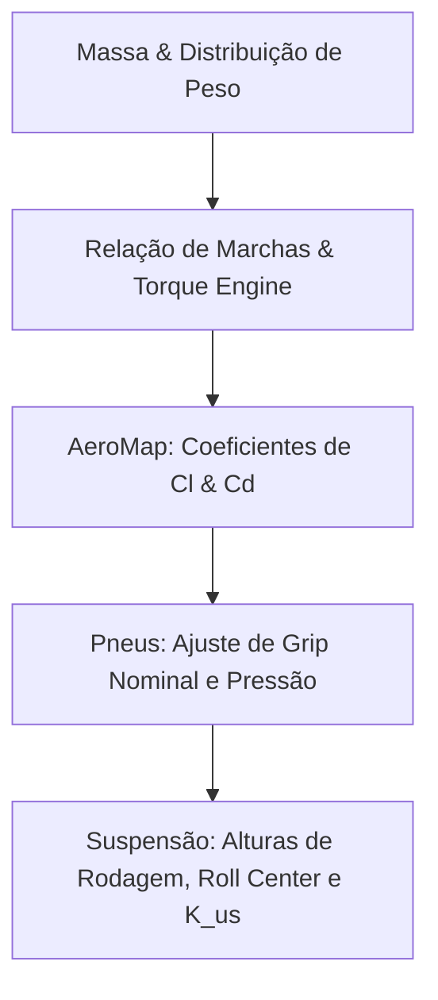

# Fichas de Calibração e Modelos de Veículos

Este documento consolida as especificações técnicas oficiais e estimativas de engenharia utilizadas para calibrar os modelos do `saru-core`.

---

## 1. Ficha Técnica: Porsche 992 GT3 R (2023-2024)

### 1.1 Parâmetros Gerais e Inerciais
- **Massa de Referência (BoP típico):** $1310\text{ kg}$
- **Potência Nominal:** $\sim 565\text{ hp}$ @ $8500\text{ rpm}$
- **Motor:** Flat-6 de $4.2\text{L}$ aspirado
- **Wheelbase ($L$):** $2507\text{ mm}$
- **Track Width (Front/Rear):** $1675\text{ mm}$ / $1598\text{ mm}$
- **Posição CG Longitudinal:** $47\%$ a $49\%$ (peso traseiro)
- **Altura do CG ($h_{\text{cg}}$):** $\sim 270\text{ mm}$ a $290\text{ mm}$
- **Inércias Estimadas:**
  - $I_{xx}$ (Roll): $\sim 350$ - $450\text{ kg}\cdot\text{m}^2$
  - $I_{yy}$ (Pitch): $\sim 1800$ - $2200\text{ kg}\cdot\text{m}^2$
  - $I_{zz}$ (Yaw): $\sim 1900$ - $2400\text{ kg}\cdot\text{m}^2$

### 1.2 Suspensão e Cinemática
- **Tipo:** Double wishbone nos quatro cantos.
- **Rigidez das Molas (Frontal):** $\sim 120$ - $140\text{ N/mm}$ (ajustável)
- **Rigidez das Molas (Traseira):** $\sim 160$ - $180\text{ N/mm}$ (ajustável)
- **Amortecedores:** Öhlins TTX36 (ajustável 3-way/4-way)
- **Altura do Centro de Rolagem (Frontal):** $50$ a $80\text{ mm}$
- **Altura do Centro de Rolagem (Traseira):** $100$ a $150\text{ mm}$

### 1.3 Aerodinâmica (AeroMap 3D)
Mapeamento aerodinâmico dependente das alturas de rodagem e atitude do chassi:
- **Faixa de Altura Frontal ($h_f$):** $35$ - $70\text{ mm}$
- **Faixa de Altura Traseira ($h_r$):** $45$ - $85\text{ mm}$
- **Yaw Angle ($\beta$):** Validade operacional de $\pm 15^\circ$
- **Coeficiente de Sustentação Frontal ($C_{l,f}$):** $1.8$ - $2.4$ (sensível a $h_f$)
- **Coeficiente de Sustentação Traseiro ($C_{l,r}$):** $2.2$ - $3.0$ (sensível a $h_r$ e asa)
- **Coeficiente de Arrasto ($C_d$):** $0.85$ - $1.05$ (dependendo da asa traseira)
- **Downforce Total Máximo:** $\sim 1400\text{ kg}$ @ $250\text{ km/h}$

---

## 2. Ficha Técnica: McLaren 720S GT3 (2019-2024)

### 2.1 Parâmetros Gerais e Inerciais
- **Massa de Referência (BoP típico):** $1300\text{ kg}$
- **Potência Nominal:** $\sim 500$ - $530\text{ hp}$ (restrito por BoP)
- **Motor:** V8 Twin-Turbo de $4.0\text{L}$ (com restritores)
- **Wheelbase ($L$):** $2670\text{ mm}$
- **Track Width (Front/Rear):** $1704\text{ mm}$ / $1668\text{ mm}$
- **Altura do CG ($h_{\text{cg}}$):** $\sim 260$ - $280\text{ mm}$

### 2.2 Suspensão e Cinemática
- **Tipo:** Suspensão acionada por pushrod com dampers TTX36.
- **Rigidez das Molas (Frontal):** $110$ - $130\text{ N/mm}$
- **Rigidez das Molas (Traseira):** $150$ - $170\text{ N/mm}$

### 2.3 Aerodinâmica
- **Downforce Máximo:** $\sim 1300\text{ kg}$ @ $250\text{ km/h}$
- **Coeficiente de Sustentação Total ($C_l$):** $3.8$ - $4.5$
- **Balanço Aerodinâmico ($Aeroballance$):** $38\%$ a $42\%$ frontal
- **Coeficiente de Arrasto ($C_d$):** $0.90$ - $1.10$

---

## 3. Ficha Técnica: Stock Car Pro Series SNG1 (Brasil - 2026)

Esta seção descreve os parâmetros homologados públicos e as lacunas que exigem estimativa por BoP.

### 3.1 Especificações Homologadas Públicas (Regulamento Técnico 2026)
- **Massa de Referência Piloto:** $85\text{ kg}$ (com equipamento completo)
- **ECU:** MoTeC M142 (firmware e calibração lacrados)
- **Data Logger:** MoTeC L120
- **Configuração Física:** Motor dianteiro longitudinal, transmissão traseira transaxle (2WD traseira).
- **Chassi:** Estrutura tubular em aço carbono (fornecida pela AudaceTech).
- **Pneus Slick:** Pirelli P Zero 300/680R18 F200.
- **Pneus Wet:** Pirelli Cinturato 300/680R18 ZZ07.
- **Suspensão:** Amortecedores e molas padronizados (fornecidos pela AudaceTech).
- **Geometria Mínima:** Lastro fixo de $15\text{ kg}$ no splitter frontal para aferição técnica. Pressão padrão de $25\text{ psi}$ nos pneus durante a vistoria.

### 3.2 Lacunas Técnicas Conhecidas (Parâmetros Estimados / BoP)
O regulamento oficial de 2026 omite dados comerciais específicos por motivos de competitividade. As seguintes variáveis de calibração são estimadas empiricamente no solver:
- **Cilindrada, Torque e Potência:** Estimados em $\sim 500\text{ hp}$ @ $6800\text{ rpm}$ e $\sim 600\text{ Nm}$ de torque.
- **Massa Total do Veículo:** Estimada em $1320\text{ kg}$ (chassi + motor + fluidos + piloto).
- **Geometria de Suspensão:** Hardpoints aproximados baseados nos chassis da geração anterior (G12/Cruze).
- **AeroMap:** Estimativas de arrasto ($C_d \approx 0.65$) e sustentação ($C_l \approx -1.8$).

---

## 4. Diretrizes de Processo de Calibração (Solver Generic & StockCar)

Para calibrar um novo modelo de veículo no solver do `saru-core`, siga estritamente esta ordem de prioridade:

### 4.1 Validação do Tempo de Volta
Assegure que os tempos de volta simulados fiquem dentro dos limites operacionais de dados reais:
- **Porsche 992 GT3 R (Interlagos):** Tempo alvo $\approx 94.0\text{ s}$ a $94.4\text{ s}$ (Referência: Hiperpole WEC LMGT3).
- **McLaren 720S GT3 (Barcelona):** Tempo alvo $\approx 103.5\text{ s}$ a $105.0\text{ s}$ (Referência: GT World Challenge).
- **Stock Car SNG1 (Goiânia):** Tempo alvo $\approx 86.5\text{ s}$ a $88.0\text{ s}$.

> **Status, 992 GT3 R @ Interlagos: CALIBRADO ✅ (94.2s).** A tripla é
> `porsche_911_gt3_r_992()` (μ=2.50, pico Hyperpole; Cl=−3.25 ≈ 1960 kg de downforce
> de quali) **+** pista TUM hi-fi (bundled `tracks/_data/interlagos.hdf5`, 862 pts, cantos reais)
> **+** racing line **pré-assado** no HDF5 (consumo com `use_racing_line=False` → solve instantâneo).
> Travado por `tests/test_qss_calibration.py`.
> Os μ/Cl são **efetivos** (topo do envelope físico): o resíduo vem do modelo de racing
> line (a min-curvature atual move só ~1.7s vs o centerline), refino futuro = linha menos
> conservadora, que permitiria μ/Cl mais próximos do nominal. A pista programática
> (`build_interlagos_real`, geometria TUM FTM real, centerline sem racing line) dá ~88.6s
> e serve só de regressão matemática (`tests/test_qss_solver.py`), não de calibração.

> **Status, McLaren 720S GT3 @ Barcelona: CALIBRADO ✅ (103.8s).** `mclaren_720s_gt3_default()`
> (μ=2.20; Cl=−2.50 ≈ 1500 kg downforce, ~nominal) **+** pista TUM Catalunya (bundled
> `tracks/_data/barcelona.hdf5`, 931 pts, racing line pré-assado). Travado por `test_qss_calibration`
> (caso parametrizado). Aqui μ/Cl ficam mais próximos do físico que no 992.

> **⚠️ RE-BASELINE INTERIM 2026-07-04 (T03, aprovado Vitor).** O seletor de marcha do QSS
> ranqueava com a curva sintética (decai ao redline) enquanto a tração usa a tabela real do
> YAML, upshift prematuro inflava o lap. Pós-fix (`_select_gear_optimal` →
> `_torque_curve_interp`, espelho do fix no saru-core-jl): Porsche @ Interlagos **86.2s**
> (−8.0s) · McLaren @ Barcelona **99.4s** (−4.4s) · centerline TUM **88.6s** (−7.4s). Os status
> "CALIBRADO" acima descrevem calibrações **co-calibradas com o seletor errado**: os alvos
> reais (94.0-94.4 / 103.5-105.0) seguem válidos como referência, mas as bandas dos testes
> travam REGRESSÃO nos valores pós-fix até recalibrar μ/Cl com load sensitivity + aero real
> (ver `calibration-guardrails`; Julia re-baseline 87.54s).
>
> **Load sensitivity μ(Fz), ESTRUTURA no QSS Python desde 2026-07-15** (espelho do
> saru-core-jl): μ_eff = μ·max(0, 1 + k·(Fz−Fz0)/Fz0), Fz0 = m·g, campo
> `TireParams.load_sensitivity` (+ chave `tire.load_sensitivity` no schema SoT).
> Default k=0.0 **neutro** (baseline byte-idêntico, travado por
> `tests/unit/test_load_sensitivity.py`).
>
> **k REAL aplicado nos presets GT3 (2026-07-15b):** pesquisa em
> `saru-KB/20_vehicle_dynamics/research/` (2 fontes independentes, Perplexity +
> Gemini deep research: Milliken RCVD, Pacejka n≈0,8, TTC/FSAE, OptimumG,
> Michelin PS GT / Pirelli DHE 30/68-18) converge em **k = −0.12 central,
> banda −0.10..−0.15** para slick GT3. Aplicado em `porsche_911_gt3_r_992` e
> `mclaren_720s_gt3_default`. Impacto medido (física real comendo fudge, laps
> aproximam do alvo real): Porsche @ Interlagos 86.18 → **86.87 s** (+0.69) ·
> McLaren @ Barcelona 99.36 → **100.56 s** (+1.20) · centerline TUM 88.57 →
> **89.64 s** (+1.07). Bandas re-baselined nos 3 oráculos. Presets sem pesquisa
> específica (Cup 991, FSAE, trucks) seguem k=0.0, FSAE tem k≈−0.15 na
> pesquisa TTC como follow-up. Próximo passo da recalibração honesta: aero real
> (cx/cl/ride-height maps) + coefs slick reais → aí re-derivar μ/Cl efetivos.
>
> **Auditoria "mu_scale-equivalente" (2026-07-15c, espelho da remoção no Julia):** com o k
> real ativo, o saru-core-jl removeu `qss_calibration.mu_scale = 0.968`, era proxy da
> load sensitivity ausente e virou dupla contagem (`be55cee`, QSS 88.19 → **87.26 s**, branch
> `feature/claude-load-sensitivity-k012`). Auditoria do lado Python: **não existe knob
> equivalente**, a cadeia de grip do oráculo hi-fi (path escalar) é
> `friction_coefficient (2.50 efetivo) × perf_factor_lat/lon (1.0 neutro) ×
> _load_sens_factor(k=−0.12)`, sem scale escondido (grep `mu_scale`/`0.968`/grip-scale = zero;
> Cd/Cl entram puros do preset + trim relativo de asa do setup; `C_rr` vem de
> `tire.rolling_resistance_coef`). A parcela de "dupla contagem" aqui está **fundida** no
> μ efetivo 2.50, calibrado pré-k, absorveu a média da penalidade de carga junto com a
> compensação (sinal oposto, dominante) de racing line conservadora/aero ausente, e é
> inseparável dele: morre na re-derivação honesta de μ/Cl (gate: aero real, acima), não
> num delete pontual. Inventar um novo μ agora p/ mexer o número = anti-padrão (tuning
> por resultado). **Baseline hi-fi INALTERADO: 86.87 s** (medido 86.872; suite 212 passed).
> Gap cross-solver Interlagos: 87.26 (Julia) × 86.87 (Python) = **0.39 s**, dentro do
> gate ±0.5 s pela primeira vez (era 1.36 pós-T03; 1.32 pós-k). Comparação segue não
> maçã-com-maçã (fudges e pistas diferem), mas o grosso do gap era o mu_scale.
